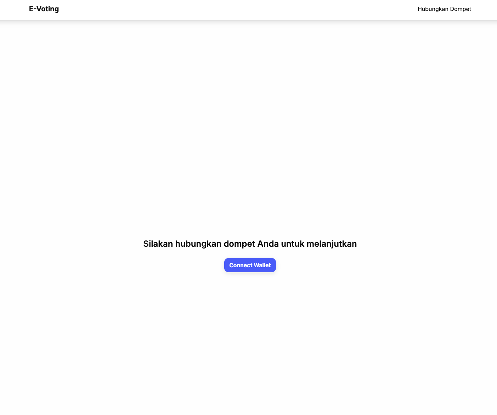
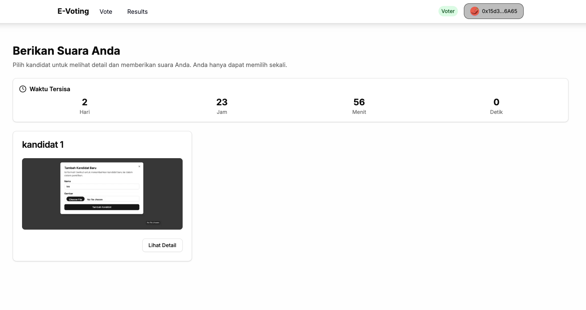
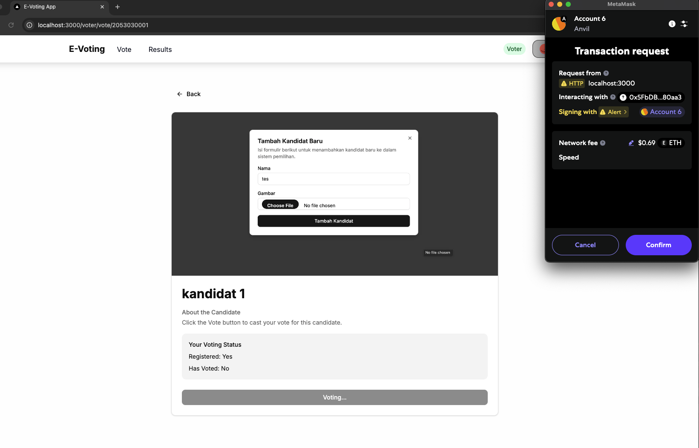
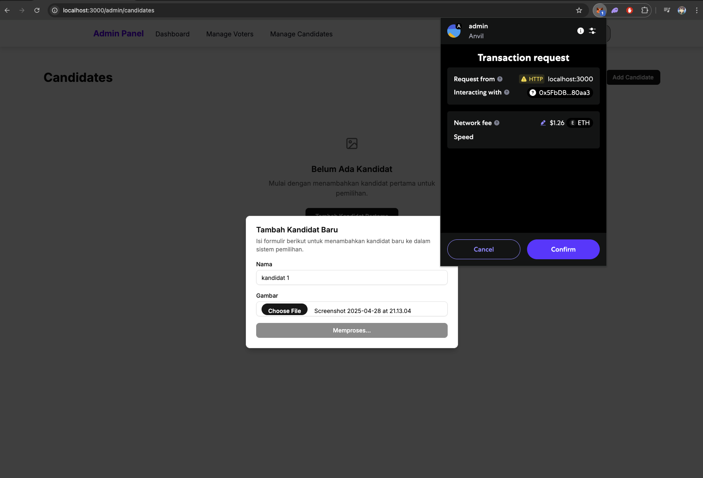
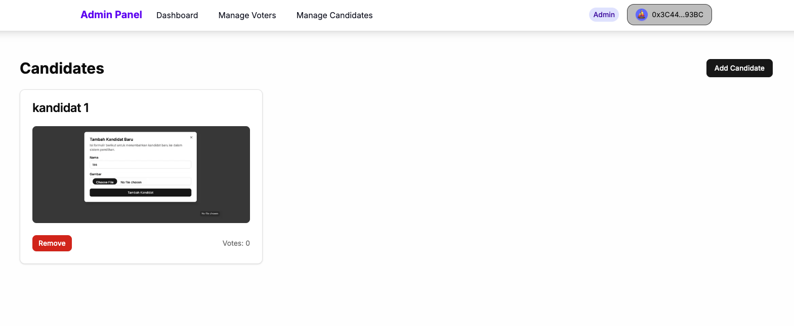
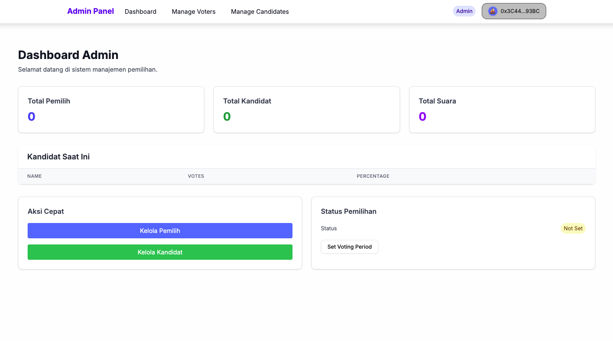
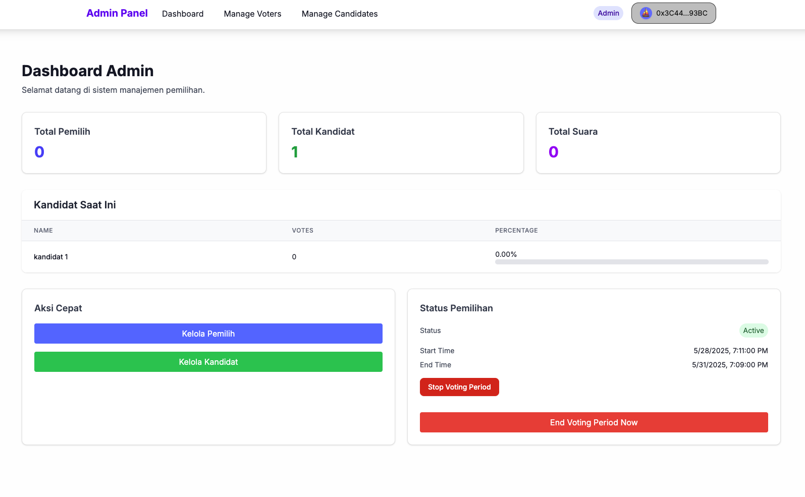
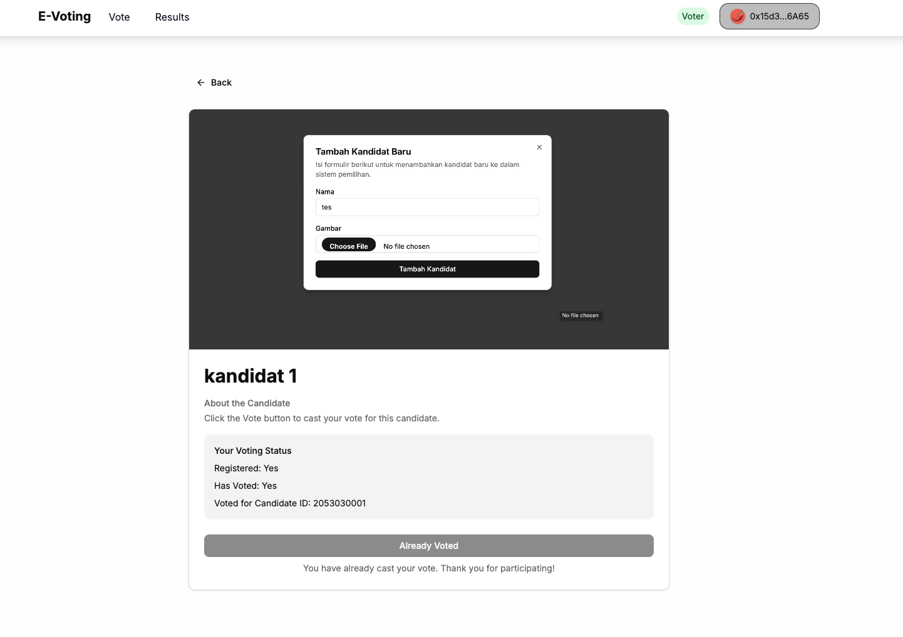
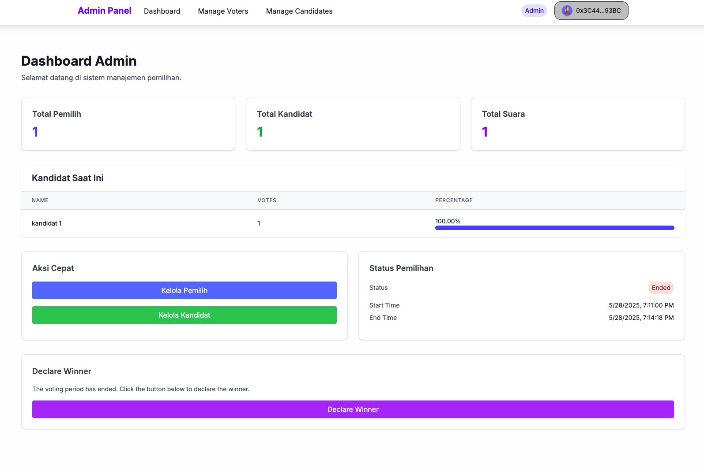

# Pemilu DApps - Decentralized Voting System

A modern, secure, and transparent decentralized voting system built with Web3 technologies. This project implements a blockchain-based voting system that ensures transparency, immutability, and security in the voting process.

## 🚀 Features

- **Decentralized Voting**: Secure and transparent voting process on the blockchain
- **Smart Contract Integration**: Automated vote counting and result verification
- **Modern Frontend**: Built with Next.js and TailwindCSS
- **Secure Backend**: FastAPI-powered backend with robust security measures
- **Web3 Integration**: Seamless wallet connection and transaction handling

## 📸 Application Screenshots

### Homepage

The main landing page of the application featuring:
- Clean and modern UI design
- Quick access to voting features
- System overview and instructions
- Navigation menu for different sections

### Voter Dashboard

The voter's main interface showing:
- Current voting period status
- Available candidates
- Voting instructions
- Real-time vote count
- User's voting status

### Voting Process

The voting interface where users can:
- Select their preferred candidate
- Review candidate information
- Confirm their vote through MetaMask
- View transaction status

### Candidate Management

Administrative interface for managing candidates:
- Add new candidates
- Upload candidate information
- Set candidate details
- Manage candidate profiles

### Candidate Confirmation

Confirmation screen showing:
- Success message for added candidates
- Candidate details
- Next steps for administrators
- System status updates

### Admin Dashboard

Main administrative control panel featuring:
- Overall system statistics
- Active voting period status
- Candidate management
- Vote monitoring
- System controls

### Voting Period Management

Interface for managing voting periods:
- Start/stop voting periods
- Set time limits
- Monitor active period
- View participation statistics

### Vote Results

Real-time voting results display:
- Vote distribution
- Candidate performance
- Total votes cast
- Percentage calculations

### Admin Controls

Advanced administrative controls:
- End voting period
- Emergency stop functionality
- System status monitoring
- Security controls

## 🏗️ Project Structure

```
pemilu-dapps/
├── frontend/          # Next.js frontend application
├── backend/           # FastAPI backend server
└── contract/          # Solidity smart contracts
```

## 🛠️ Technology Stack

### Frontend
- Next.js 15
- React 19
- TailwindCSS
- RainbowKit for Web3 integration
- Wagmi for Ethereum interactions

### Backend
- FastAPI
- Python 3.x
- Web3.py
- Uvicorn

### Smart Contracts
- Solidity
- Foundry for development and testing

## 🚀 Getting Started

### Prerequisites
- Node.js (v18 or higher)
- Python 3.x
- Foundry
- MetaMask or any Web3 wallet

### Installation

1. Clone the repository:
```bash
git clone https://github.com/yourusername/pemilu-dapps.git
cd pemilu-dapps
```

2. Frontend Setup:
```bash
cd frontend
npm install
npm run dev
```

3. Backend Setup:
```bash
cd backend
python -m venv .venv
source .venv/bin/activate  # On Windows: .venv\Scripts\activate
pip install -r req.txt
uvicorn app.main:app --reload
```

4. Smart Contract Setup:
```bash
cd contract
forge install
forge build
```

## 📝 Usage

1. Connect your Web3 wallet (MetaMask recommended)
2. Navigate to the voting page
3. Select your candidate
4. Confirm the transaction
5. Wait for the transaction to be confirmed
6. View the results in real-time

## 🔒 Security Features

- Smart contract security best practices
- Input validation and sanitization
- Rate limiting
- Secure wallet integration
- Transaction verification

## 🔮 Future Development

### Planned Improvements

1. **Web Flow Optimization**
   - Streamline user navigation
   - Improve transaction flow
   - Enhance user experience
   - Add guided tutorials
   - Implement better error handling

2. **Winner Declaration System**
   - Add automatic winner calculation
   - Implement winner announcement feature
   - Add result verification system
   - Create winner dashboard
   - Generate result certificates

3. **Additional Features**
   - Real-time notifications
   - Enhanced analytics dashboard
   - Mobile responsiveness improvements
   - Multi-language support
   - Advanced reporting tools

## 🤝 Contributing

Contributions are welcome! Please feel free to submit a Pull Request.

## 📄 License

This project is licensed under the MIT License - see the LICENSE file for details.

## 📞 Support

For support, please open an issue in the GitHub repository or contact the maintainers.

